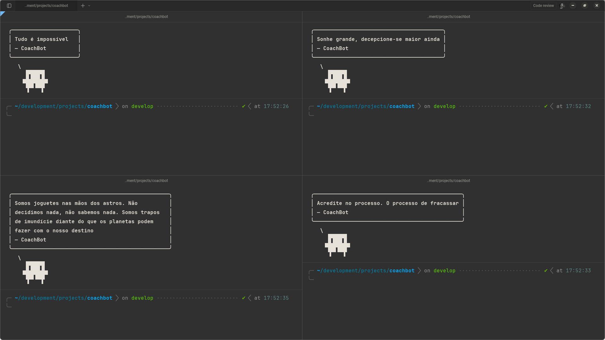

# CoachBot

Your anti-motivational coach for the terminal. Displays a random sarcastic quote every time you open a new shell. Available in English and Portuguese (Brazil).



## Install

```bash
curl -sSL https://raw.githubusercontent.com/nandomoreirame/coachbot-cli/main/install.sh | bash
```

This installs `coachbot`, `phrases.json` and `phrases-pt-br.json` to `~/.local/bin/`.

To install to a different directory:

```bash
curl -sSL https://raw.githubusercontent.com/nandomoreirame/coachbot-cli/main/install.sh | COACHBOT_INSTALL_DIR=/usr/local/bin bash
```

## Usage

```bash
coachbot                     # English (default)
coachbot --lang pt-br        # Portuguese (Brazil)
coachbot -l pt-br            # Short flag
coachbot --list-langs        # Show available languages
coachbot --help              # Show help
```

You can also set the default language with the `COACHBOT_LANG` environment variable:

```bash
export COACHBOT_LANG=pt-br
coachbot                     # Now defaults to Portuguese
```

## Shell setup

Add `coachbot` to your shell profile so it runs every time you open a terminal.

### Bash

```bash
echo 'coachbot' >> ~/.bashrc
# or with Portuguese:
echo 'coachbot --lang pt-br' >> ~/.bashrc
```

### Zsh

```bash
echo 'coachbot' >> ~/.zshrc
# or with Portuguese:
echo 'coachbot --lang pt-br' >> ~/.zshrc
```

### Fish

```bash
echo 'coachbot' >> ~/.config/fish/config.fish
# or with Portuguese:
echo 'coachbot --lang pt-br' >> ~/.config/fish/config.fish
```

### PowerShell (Windows)

```powershell
Add-Content $PROFILE 'bash -c coachbot'
# or with Portuguese:
Add-Content $PROFILE 'bash -c "coachbot --lang pt-br"'
```

If `~/.local/bin` is not in your `PATH`, add it first:

```bash
# Bash
echo 'export PATH="$HOME/.local/bin:$PATH"' >> ~/.bashrc

# Zsh
echo 'export PATH="$HOME/.local/bin:$PATH"' >> ~/.zshrc

# Fish
fish_add_path ~/.local/bin
```

Restart your terminal or source the profile:

```bash
source ~/.bashrc   # or ~/.zshrc
```

## Uninstall

```bash
rm ~/.local/bin/coachbot ~/.local/bin/phrases.json ~/.local/bin/phrases-pt-br.json
```

Remove the `coachbot` line from your shell profile (`~/.bashrc`, `~/.zshrc`, etc.).

## License

MIT
